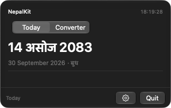

<div align="center">
  <h1>NepalKit</h1>
  <p><em>Today's Bikram Sambat date in your Mac's menu bar, with Nepal Time and a date converter.</em></p>
</div>

<p align="center">
  <a href="https://github.com/dibas-np/NepalKit/releases/latest"></a>
  <a href="https://github.com/dibas-np/NepalKit/releases"></a>
  <a href="LICENSE"></a>
  
  
  <a href="https://github.com/dibas-np/NepalKit/actions/workflows/macos26-floor.yml"></a>
</p>

<p align="center">
  
</p>

## Features

- **Menu-bar date**: today's Bikram Sambat (BS) date, always visible. No Dock icon, launches at login.
- **Today at a glance**: full BS date with the Gregorian date and weekday beneath it.
- **Nepal Time**: a live UTC+5:45 clock, plus your local time when your zone differs.
- **Safe converter**: BS ↔ AD conversion with pickers bounded by real month lengths, so invalid dates can't be selected.
- **Display options**: Latin or Devanagari digits, Nepali or transliterated month names.
- **Private**: fully offline. No analytics, no telemetry, no account. The only network access is the update check.

## Install

Requires **macOS 26 or later**. Runs natively on Apple Silicon.

```sh
brew install --cask dibas-np/tap/nepalkit
```

Or download the DMG from the [latest release](https://github.com/dibas-np/NepalKit/releases/latest) and drag NepalKit into Applications.

NepalKit is signed, notarized, and updates itself in place via [Sparkle](https://sparkle-project.org). **Pick one updater.** Homebrew installs the same app to the same place, so installing it with `brew` and then letting Sparkle move it forward leaves the two disagreeing about which version is installed. Homebrew is told this app updates itself, so `brew upgrade` leaves it alone rather than reinstalling over it.

> **Upgrading from 1.0?** Version 1.0 can't update itself. Install 1.1 or later once; every version after that updates automatically.

## Usage

Click the menu-bar date to open the popover, which has two tabs: **Today** (BS and Gregorian dates, clocks) and **Convert**. Digit style and month names are configured in **Settings** (Cmd-,) and apply everywhere.

NepalKit supports **1975–2084 BS** (1918-04-13 to 2028-04-12). Dates outside this range are reported as unsupported rather than guessed.

## Calendar data

Bikram Sambat month lengths follow no formula, so conversion is table-driven. The bundled dataset (v2.0.0) is cross-checked against multiple independent community tables and the Kathmandu Metropolitan City calendar. Every supported New Year boundary is tested in both directions.

- **2084 BS is projected.** The official almanac is published through 2083; 2084 is expected around early 2027. Available sources agree on it, but it has not been officially confirmed.
- **Nothing is extrapolated.** Years without reliable data are excluded.
- **The GPL license covers the code, not the calendar table.** See [SOURCES.md](SOURCES.md) for the data's provenance. Anyone relying on the calendar for official purposes should consult the Panchanga Nirnayak Samiti.

## Development

Requires Xcode 26.6+ on macOS 26+.

```sh
git clone https://github.com/dibas-np/NepalKit.git
cd NepalKit
open NepalKit.xcodeproj
```

```sh
# Core library (conversion, dataset, formatting)
cd NepalKitCore && swift test

# App layer
./scripts/run-app-tests.sh
```

```
NepalKitCore/   Calendar dataset, BS ↔ AD conversion, formatting (Foundation only)
NepalKit/       Menu-bar app: UI, settings, models
NepalKitTests/  App-layer tests
scripts/        Test runner, release packaging, appcast verification
docs/adr/       Architecture decision records
```


## Changelog

See [CHANGELOG.md](CHANGELOG.md).

## License

[GPL-3.0-or-later](LICENSE). The bundled calendar table is not covered by this license; see [Calendar data](#calendar-data).

## Acknowledgements

Calendar data cross-checked against several independent open converters and
confirmed against officially published Nepali calendars.
