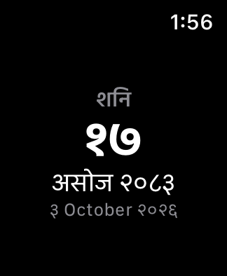
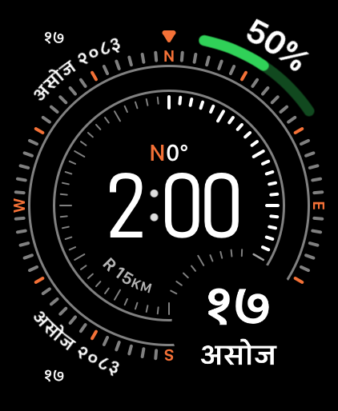

<div align="center">
  <h1>NepalKit</h1>
  <p>Today's Bikram Sambat date in your Mac's menu bar.</p>
  <p>Nepal Time, Gregorian date conversion, and Siri and Shortcuts support in a native macOS app.</p>
</div>

<p align="center">
  <a href="https://github.com/dibas-np/NepalKit/releases/latest"></a>
  <a href="https://github.com/dibas-np/NepalKit/releases"></a>
  
  <a href="https://github.com/dibas-np/NepalKit/actions/workflows/macos26-floor.yml"></a>
  <a href="LICENSE"></a>
</p>

<p align="center">
  
</p>

## Features

- Today's Bikram Sambat date in the menu bar, without a Dock icon.
- Full Bikram Sambat and Gregorian dates with the weekday.
- A live Nepal Time clock, UTC+5:45, alongside your local time when your time zone differs.
- Conversion between Bikram Sambat and Gregorian, with date pickers that follow each month's actual length.
- Latin or Devanagari digits, with Nepali or transliterated month and weekday names.
- Today's Bikram Sambat date through Siri, and date conversion through Shortcuts.
- An Apple Watch app and four complication styles for Today's date (in development).
- Optional launch at login.

Date conversion and clocks work offline. NepalKit has no account, analytics, or telemetry. The app uses network access for updates.

## Install

Requires macOS 26.6 or later on Apple Silicon.

[Download the latest release](https://github.com/dibas-np/NepalKit/releases/latest), open the DMG, and drag NepalKit into **Applications**.

You can also install with Homebrew:

```sh
brew install --cask dibas-np/tap/nepalkit
```

Release builds are signed and notarized. NepalKit updates itself through Sparkle, including when installed with Homebrew. The cask declares automatic updates, so a normal `brew upgrade` leaves the app's updates to NepalKit.

If you still use version 1.0, install a newer release once to enable automatic updates.

## Usage

Click the menu-bar date to open the popover. **Today** shows the dates and clocks. **Convert** lets you convert a date in either direction.

Open **Settings** with **⌘,** to change the menu-bar display, digit script, month and weekday names, or launch-at-login preference.

Today's date follows Nepal Time, even when your Mac uses another time zone. The month-name setting applies to Bikram Sambat months and weekdays. Gregorian month names remain in English.

## Siri and Shortcuts

Ask Siri:

> What is today's Nepali date with NepalKit

NepalKit answers with today's Bikram Sambat date and weekday using its bundled calendar data.

The Shortcuts app includes three NepalKit actions:

- Get today's Bikram Sambat date.
- Convert a Gregorian date to Bikram Sambat.
- Convert a Bikram Sambat date to Gregorian.

Conversion actions return year, month, day, and weekday fields that you can use in other shortcut steps.

Spoken answers use Latin digits and your chosen month-name language. Dates displayed in Shortcuts follow your display settings, including Devanagari digits.

Date conversions currently work through Shortcuts. Siri cannot yet collect the conversion parameters reliably. Available phrases appear in **Settings → General → Siri & Shortcuts**.

## On the Apple Watch

<p align="center">
  
  
</p>

NepalKit lives on the watch face with four complication styles — rectangular, inline, circular, and corner. Tapping a complication opens Today: the full Bikram Sambat date with its weekday and the corresponding Gregorian date for the Nepal Time day.

The Watch app works offline and follows Nepal Time regardless of the watch's time zone. It requires watchOS 26 or later.

The Watch app is in development and not part of the current download.

## Supported dates and calendar data

NepalKit supports **1975 through 2084 Bikram Sambat**, corresponding to **April 13, 1918 through April 12, 2028 Gregorian**. Dates outside the bundled dataset are reported as unsupported.

Bikram Sambat month lengths vary, so conversion uses a bundled table rather than a formula. Dataset version 2.0.1 is cross-checked against independent community tables. The Kathmandu Metropolitan City calendar was compared against the previous 2.0.0 row, and that comparison does not describe the current one. Tests check every supported New Year boundary in both directions.

**2084 Bikram Sambat is projected.** The source record documents official publication through 2083. The shipped 2084 row is a provisional projection adopted pending comparison with the official Nepali Patro, and it deliberately differs from the community tables and the government calendar that the previous version agreed with. It follows a reported birthday and Chaitra recurrence, not an attested calendar or a verified astronomical calculation. [SOURCES.md](SOURCES.md) records the comparison and its limits. Years beyond the supported range are excluded.

Read [SOURCES.md](SOURCES.md) for provenance, source disagreements, and data licensing. For official use, consult the Panchanga Nirnayak Samiti's published Nepali Patro.

## Development

Use Xcode 27 or later on macOS 27 or later. The app's deployment target remains macOS 26.6.

```sh
git clone https://github.com/dibas-np/NepalKit.git
cd NepalKit
open NepalKit.xcodeproj
```

Select the **NepalKit** scheme in Xcode and run the app. The Watch app builds and runs the same way from the **NepalKitWatch Watch App** scheme with a watch simulator or device destination.

To build the app and run the local checks from the repository root:

```sh
./scripts/check-all.sh
```

The script builds the app, runs SwiftLint, executes the core, app-layer, and Watch tests, checks the supporting scripts, and verifies the deployment target. It runs eleven gates, which [CONTRIBUTING.md](CONTRIBUTING.md) lists in order, and documents the separate calendar provenance and release checks that the script does not run.

To run the three Swift test suites separately:

```sh
(cd NepalKitCore && swift test)
./scripts/run-app-tests.sh
xcodebuild test -project NepalKit.xcodeproj -scheme "NepalKitWatch Watch App" \
    -configuration Debug \
    -destination 'platform=watchOS Simulator,name=Apple Watch SE 3 (40mm),OS=27.0' \
    CODE_SIGNING_ALLOWED=NO
```

The Watch tests run on a watchOS Simulator, as the directory listing below notes. That exact device and runtime have to be installed, or `xcodebuild` fails with a list of the destinations it can use.

```text
NepalKitCore/                 Calendar dataset, conversion, formatting, and spoken dates
NepalKit/                     SwiftUI menu-bar app, settings, models, and App Intents
NepalKitTests/                App-layer tests
NepalKitWatch Watch App/      SwiftUI Watch app, Today screen, and lifecycle model
NepalKitComplications/        Watch complications (WidgetKit extension)
NepalKitWatch Watch AppTests/ Watch tests, run on a watchOS simulator
scripts/                      Local checks, release packaging, and verification
docs/adr/                     Architecture decision records
```

Read [CONTRIBUTING.md](CONTRIBUTING.md) and [CODING_STANDARDS.md](CODING_STANDARDS.md) before submitting changes.

## Changelog

See [CHANGELOG.md](CHANGELOG.md).

## License

The code is licensed under [GPL-3.0-or-later](LICENSE). The bundled calendar table has separate provenance and licensing considerations documented in [SOURCES.md](SOURCES.md).
